# AZTCast

Turns a magnet link into an adaptive HLS stream you can watch in the browser.

```
magnet URI ──▶ acquisition ──▶ transcoding ──▶ playback ──▶ nginx ──▶ browser
               (bt library)    (ffmpeg)        (authorises) (sendfile)
                     └──────── ingestion ────────┘
                          (drives and tracks)
```

Playback resolves and authorises; **nginx writes the segment bytes**. A request
for a segment costs the JVM a path resolution and a `stat`, not a worker thread
held for the length of a transfer — see
[ADR-0007](docs/decisions/0007-nginx-serves-the-bytes.md).

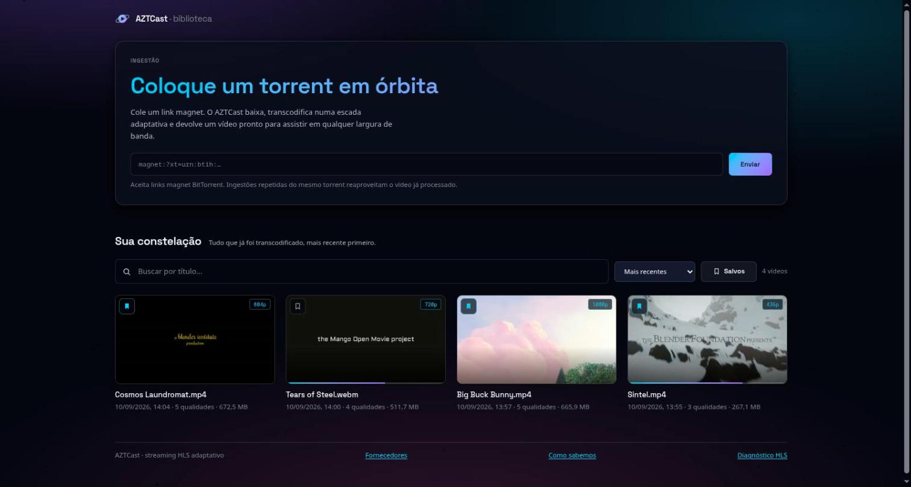

*Four Creative Commons films and four different ladders, none of them
configured per video. The planner will not build a rung taller than the source,
so Sintel — 436 lines tall — gets three; and it only prepends a copied top rung
when the source is already H.264, which is why Tears of Steel arrives as WebM
and gets four where Cosmos Laundromat, a similar height, gets five.*

| Directory        | What it is                                                     |
| ---------------- | -------------------------------------------------------------- |
| `streaming-api/` | Spring Boot 3.5 / Java 21 API: acquires, transcodes, serves HLS |
| `web-player/`    | Vanilla-JS player built with Vite, using hls.js                 |
| `deploy/`        | docker compose (API, nginx, Redis) and the nginx configuration   |
| `docs/`          | Architecture, API contract, runbook, decision records           |
| `scripts/`       | Prerequisite check, dev runner, smoke test                      |

## Prerequisites

- **JDK 21**
- **Node 20+**
- **ffmpeg** with an H.264 encoder — a hard runtime dependency; the API shells
  out to it for every transcode
- **Redis** — *optional*, and off by default. `docker compose` runs one; a local
  `make dev` does not need it. See [what it costs to run without](#redis).

```bash
./scripts/check-prereqs.sh
```

It also reports what this particular ffmpeg can do, which is not the same question
as whether ffmpeg is installed: which H.264 encoder will be picked, which decoders
are missing, and whether hardware acceleration actually opens. Nothing there fails
the run — the service adapts to whatever it finds. `video-codec: auto` takes the
first encoder the build has, so a distribution shipping a patent-free ffmpeg needs
no profile of its own; a missing audio decoder means that track is copied through or
dropped rather than failing the ingestion. What each answer costs you is spelled out
in [docs/troubleshooting-hls.md](docs/troubleshooting-hls.md), and the script names
the package that would change it.

## Running it

```bash
make dev          # API on :8080, player on :5173
make dev-down     # stop a leftover run still holding those ports
```

`make dev` clears whatever a previous run left behind before it starts, so a
session that crashed does not block the next one. It only ever signals processes
belonging to this checkout: if something else holds :8080 or :5173 it names the
process and stops rather than killing a stranger. `FORCE_PORTS=1` overrides that.

Or separately:

```bash
make api          # cd streaming-api && ./mvnw spring-boot:run
make web          # cd web-player && npm run dev
```

The player reaches the API through Vite's `/api` proxy, so the browser only ever
makes same-origin requests.

### In containers

```bash
make up           # http://localhost:8000
WEB_PORT=8100 docker compose -f deploy/docker-compose.yml up --build -d
```

nginx serves the player and proxies `/api` to the API on the same origin.

#### Through a VPN

```bash
cp deploy/vpn.env.example deploy/vpn.env      # then fill in your provider's keys
docker compose -f deploy/docker-compose.yml -f deploy/docker-compose.vpn.yml up --build
```

An overlay, so the stack above still runs without it. The API joins a
[gluetun](https://github.com/qdm12/gluetun) container's network namespace, so every packet it
sends — DHT's UDP included — leaves through the tunnel, and gluetun's firewall drops anything
that would not. Trackers and peers then see the VPN's address instead of this machine's.

**It is not anonymity.** The VPN provider still sees the traffic, and anyone who can compel or
compromise them is back where they started. What it does is real and it is also all it does.
Because the API shares the tunnel's namespace, a dropped VPN takes the API offline rather than
falling back to the open internet — the safe failure, and the reason for doing it this way
([ADR-0015](docs/decisions/0015-ip-masking-belongs-to-the-network.md)).

Verify it is working:

```bash
docker compose -f deploy/docker-compose.yml -f deploy/docker-compose.vpn.yml \
  exec streaming-api curl -s https://ifconfig.me      # the VPN's address, not yours
```

## Something to watch

The pipeline needs a real torrent, and the four films below are freely
redistributable, well seeded, and small enough to finish while you read this
section. They are what every screenshot in this README was taken against, so you
can reproduce the whole document:

```bash
# Sintel — 129 MB, 436 lines tall, so a three-rung ladder
curl -X POST localhost:8080/api/v1/videos -H 'Content-Type: application/json' \
  -d '{"magnetUrl":"magnet:?xt=urn:btih:08ada5a7a6183aae1e09d831df6748d566095a10&dn=Sintel&tr=udp://tracker.opentrackr.org:1337"}'

# Big Buck Bunny — 276 MB, 1080p, the full five rungs
curl -X POST localhost:8080/api/v1/videos -H 'Content-Type: application/json' \
  -d '{"magnetUrl":"magnet:?xt=urn:btih:dd8255ecdc7ca55fb0bbf81323d87062db1f6d1c&dn=Big+Buck+Bunny&tr=udp://tracker.opentrackr.org:1337"}'
```

All four are © the Blender Foundation under CC-BY, from
[peach.blender.org](https://peach.blender.org) and its siblings. Tears of Steel
is worth adding third: it arrives as WebM, so nothing can be copied and all four
rungs are encoded, which is the slow path and the one worth watching.

Two things this does not do. It does not make the download private — see the VPN
overlay above. And it does not make it fast: the swarm decides that, and a thin
torrent is slow no matter what this side does.

## Using it

Five pages. `/` is the library: everything already transcoded, newest first, each
with a poster frame and the name of the file it came from. Click one and it opens
on `/player.html?v=<videoId>`, which is where video is watched. `/providers.html` is
where each download came from — a world map of the peers that served it, drawn from data
compiled into the build so the page makes no external request at all.
`/localizacao.html` is that page's footnote: what an IP address does and does not
reveal, and why each of the provenance page's three claims is true.
`/diagnostics.html` is the fifth: it compares what a manifest advertises against
what the browser accepts and what the server actually serves.

The library is read from disk rather than from job state, so a video is listed for
as long as its media exists — a restart that loses every job record does not empty
it. Search and sort act on the listing in the browser, not as a query: the endpoint
returns everything on disk and the retention window keeps that small.

**Videos you save are not deleted.** Media older than the retention window is reaped
automatically, which is what keeps the disk from filling; the marker in the corner of
each card exempts that video from it, and the **Salvos** filter shows only the ones
you have marked. What persists is the watchable ladder — the raw torrent underneath it
still expires on schedule, because it is a second full copy of the same video and
nothing seeds it
([ADR-0019](docs/decisions/0019-kept-videos-outlive-the-retention-window.md)).

Paste a magnet link on the library page and press **Enviar** to add one. It polls
the job with a backoff and opens the watch page once it is `READY`; a failure shows
its reason rather than a 404 you have to interpret.

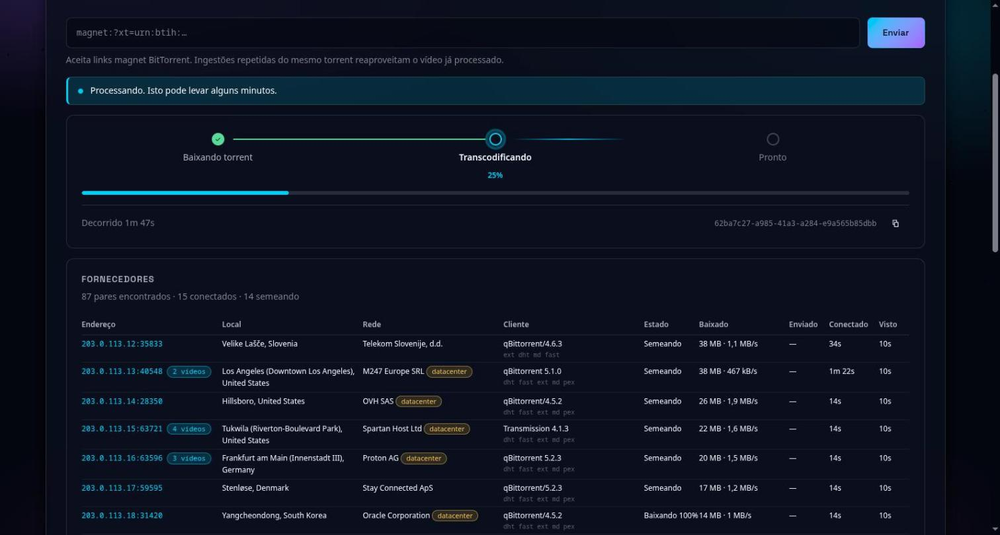

*Both halves of the work carry a real number. The download's comes from the swarm
reporting pieces; the transcode's from parsing ffmpeg's own `-progress` stream
against the source duration. Underneath, the peers actually serving this torrent,
their addresses masked for this screenshot but nothing else changed.*

Both figures are real, and they are deliberately two fields rather than one:
told that `progressPercent` meant the whole job, a client would watch it reach
100, drop to zero, and climb again. `transcodePercent` is null until the encode
starts, so "not begun" and "0% done" are distinguishable without a third field
to say which ([ADR-0024](docs/decisions/0024-transcode-progress-is-its-own-figure.md)).
A source that declares no duration reports nothing at all rather than a
percentage of an unknown total.

**Reloading the page no longer loses the download.** The library asks
`GET /api/v1/videos/active` on load and picks any ingestion still running back up,
percentage and elapsed time intact
([ADR-0013](docs/decisions/0013-an-ingestion-survives-the-page-that-started-it.md)).
A resumed one does not steal the page: it reports when it is ready rather than
navigating there on its own.

### Watching

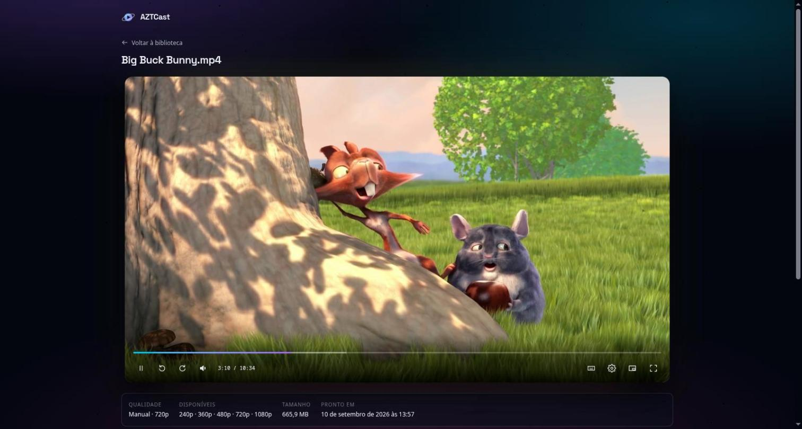

*The controls are the application's own. The pale band ahead of the playhead is
the buffer hls.js has actually appended — the one thing a native control bar
will not show you.*

The player's controls are the application's own, not the browser's
([ADR-0012](docs/decisions/0012-custom-player-controls.md)): buffered ranges are
drawn on the seek bar, the quality ladder and playback speed live in one menu, and
where you stopped is remembered per video in `localStorage` and offered back — never
seeked to on its own.

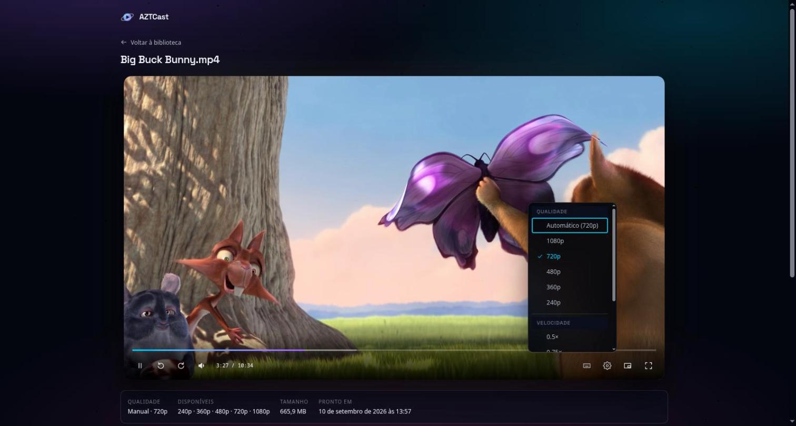

*Every rung the ladder actually built, plus the automatic choice and what it
currently resolves to. A subtitle group appears here too when the source carried
text tracks — these films do not, so it is absent rather than empty
([ADR-0022](docs/decisions/0022-subtitles-become-webvtt-sidecars.md)).*

Keyboard, on the watch page. `?` shows the same list in the player.

| | |
| --- | --- |
| `Espaço` `K` | reproduzir / pausar |
| `J` `L` | −10 s / +10 s |
| `←` `→` | −5 s / +5 s |
| `↑` `↓` | volume |
| `0`–`9` | saltar para 0%…90% |
| `<` `>` | velocidade |
| `M` `F` `P` | mudo, tela cheia, picture-in-picture |

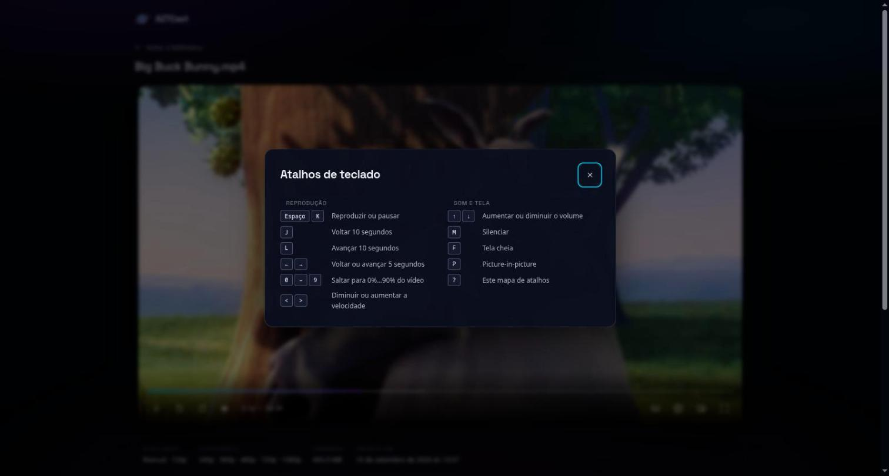

Same thing over HTTP, if you would rather:

```bash
# start an ingestion — idempotent per torrent, so a retry returns the same job
curl -X POST localhost:8080/api/v1/videos \
  -H 'Content-Type: application/json' \
  -d '{"magnetUrl":"magnet:?xt=urn:btih:..."}'

# poll until READY, with a backoff — not in a tight loop
curl -s localhost:8080/api/v1/videos/<videoId>
```

Ingestion is rate limited per client (default: burst of 5, 20/hour). Playback is
not — a player pulls dozens of segments a minute.

Full contract: [docs/api.md](docs/api.md). Interactive: `/swagger-ui.html`.

### Who served it

With `aztcast.streaming.providers.enabled` set, every peer seen for a download is recorded to a
SQLite file and shown under the progress track while it runs: address and port, the client
software, **how many bytes it actually sent**, whether it is seeding or still fetching, and how
often it connected. Point `geoip-city-database` and `geoip-asn-database` at any MaxMind-format
`.mmdb` — GeoLite2 needs a free account, DB-IP Lite and IP2Location LITE do not — and each
address also resolves to a country, a city and a network operator, read from that local file.

**`/providers.html` is where it all comes back.** Totals, a world map of every place that
served something, and one row per video that opens into its peer table.

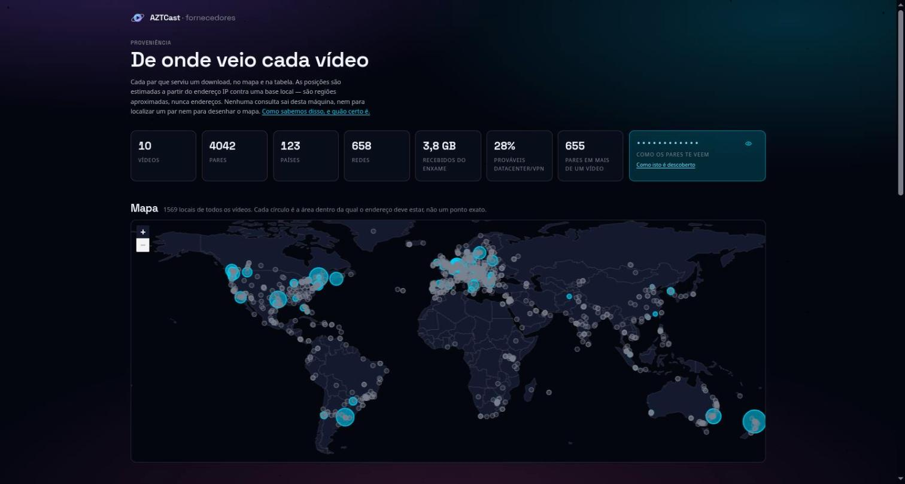

*Fifteen hundred places, from four torrents. The map has no tile layer — country
outlines are bundled, so the page that shows you where your peers are does not
tell a third party where you are looking
([ADR-0016](docs/decisions/0016-the-provenance-map-is-drawn-offline.md)). Circles
are areas, never points, because GeoIP cannot locate a street.*

Positions are city-level estimates drawn as areas, never points — GeoIP
cannot locate a street, and a map that could zoom to one would be lying.

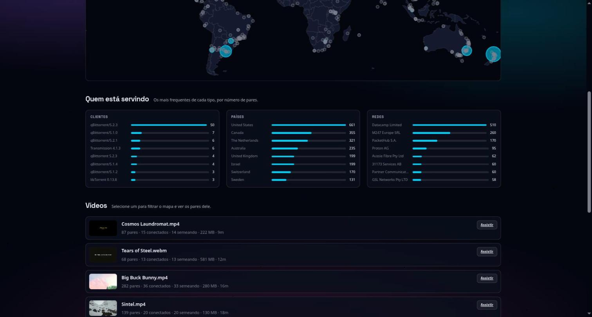

*Ranked by client, country and network. That the top three networks are hosting
providers rather than home connections is the interesting part, and it is
derived from the operator name already stored — so it costs no extra request.*

It also ranks who is serving you — by client, country and network — and marks each peer that sits
on a **probable datacenter or VPN** rather than a home connection, or that has turned up in more
than one of your downloads. Both are read from the operator name already stored, so neither costs a
request.

The page reports **the address peers say they see you as**, taken from their handshakes. That is the
only direct evidence there is that the VPN above is actually masking anything.

It arrives masked and reveals on a click. The value is no secret — every peer in
the swarm already has it — but this is the page someone opens to check whether a
tunnel is working, which makes it the page most likely to end up in a screenshot,
a bug report, or a message to whoever set the tunnel up. Every other address on
the page belongs to a stranger and is the page's subject; that one belongs to
whoever is reading it
([ADR-0029](docs/decisions/0029-the-address-is-masked-until-asked-for.md)).


*Every claim the provenance page makes has somewhere to be checked. This page is
where `yourip`, the accuracy radius and the shape of a geolocation database are
explained, with the primary sources cited.*

It is **off by default**, and worth knowing why before switching it on: peer addresses are
personal data under the LGPD, so rows expire after 30 days and nothing about a lookup leaves
this machine. It is also worth knowing the ceiling — BitTorrent exposes an address, a port and
a self-reported client string, and nothing that names a person
([ADR-0014](docs/decisions/0014-a-provider-log-in-sqlite.md)).

### When it does not play

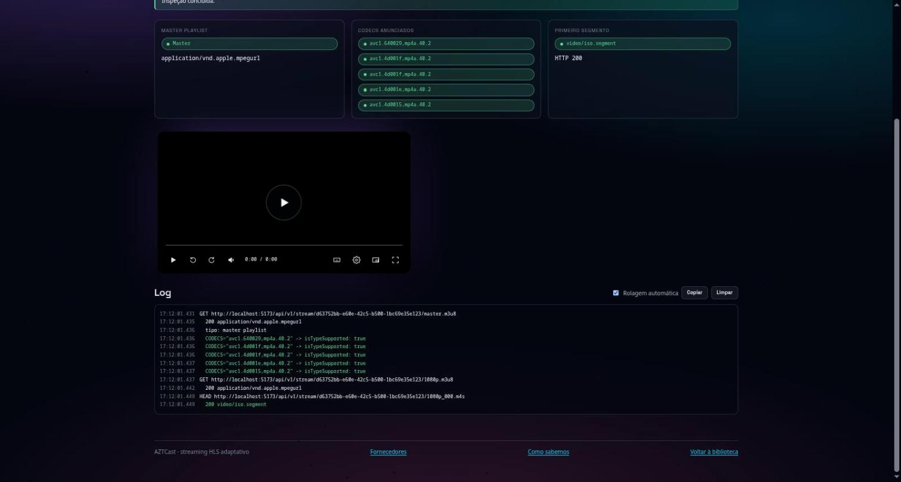

*Three questions decide whether HLS plays, and this is the only place they are
asked side by side: what the manifest advertises, what this browser accepts, and
what the server actually serves. Note `avc1.640029` on the copied top rung
against `avc1.4d001f` on the encoded ones — those strings are measured off the
output, not predicted from the plan.*

`/diagnostics.html` takes a videoId and reports the master playlist's content
type, every `CODECS` string tested against `MediaSource.isTypeSupported`, and the
MIME type the server returns for the first segment — then logs the whole
exchange so it can be pasted into a bug report. The checklist for reading it is
in [docs/troubleshooting-hls.md](docs/troubleshooting-hls.md).

## How it works

Three figures for the shape of it. The deep set — the slice graph, the thread
handoffs, the ladder's filter chain, the audio decision, the repair tree and the
container topology — is in [docs/architecture.md](docs/architecture.md).

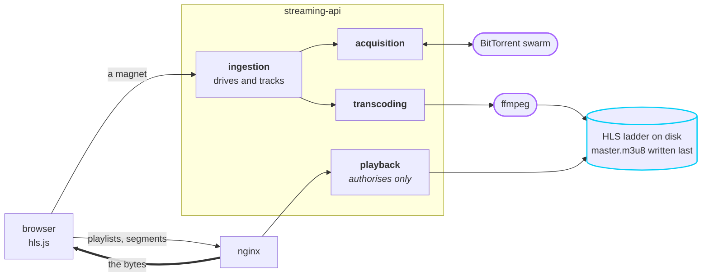

The two rounded boxes are the only process boundaries in the system, and they are
the only two places an interface earns its keep: neither a swarm nor a binary can
run inside a unit test.

**One segment, end to end.** The JVM answers with headers and a redirect; nginx
answers with the file.

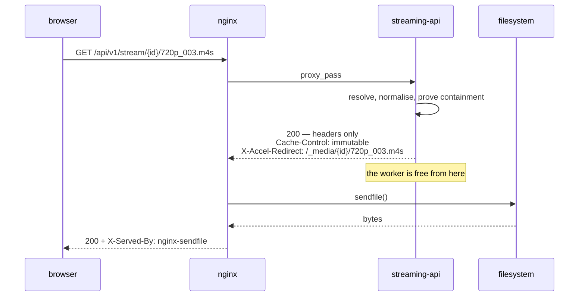

That last header exists so the offload is verifiable from outside. Without it, a
regression that quietly routed bytes back through the JVM would look identical
from the browser.

**One job, four states.** `progressPercent` is the download's and only the
download's; `transcodePercent` is the encode's.

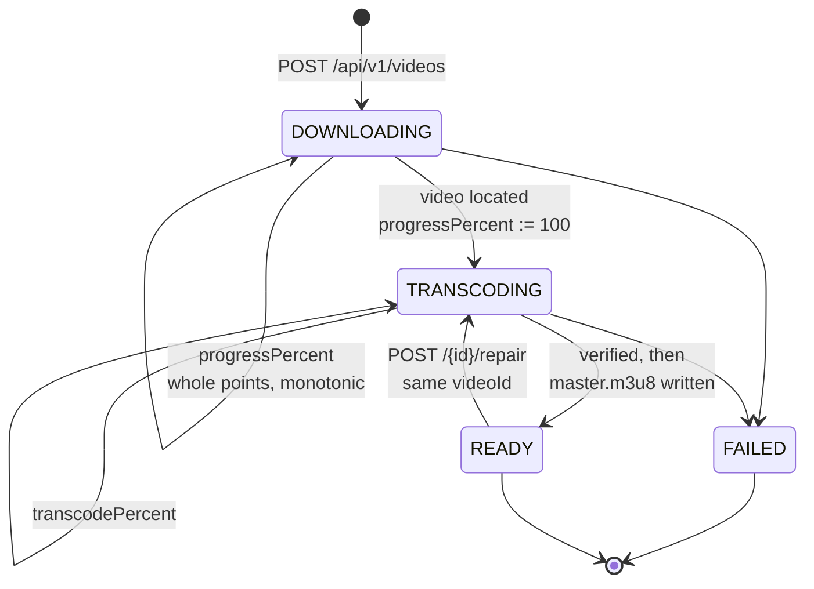

Nothing resumes across a restart, so every unfinished job is failed at startup
rather than left claiming progress it is no longer making. Repair is the one
transition back out of `READY`, and it reuses the same `videoId` on purpose — a
viewer's link, the library card and the keep marker are all that id
([ADR-0026](docs/decisions/0026-verified-before-it-is-published-repairable-after.md)).

## Redis

Optional. It holds job state, the magnet→videoId claims that make ingestion
idempotent, and rate-limit counters. **It holds no media** — a value over roughly
a megabyte displaces thousands of useful keys and stalls Redis's single event
loop for every other client, and a segment is far larger than that
([ADR-0009](docs/decisions/0009-redis-for-state-not-for-media.md)).

Without it (`aztcast.streaming.redis.enabled=false`, the default) the service
behaves as it always did: job state is per-instance and lost on restart,
duplicate ingestions are not detected, and ingestion is not rate limited.

**Playback never touches Redis in either case.** Serving a segment is a path
resolution and a `stat`, so a Redis outage means "job status is unavailable",
not "nobody can watch anything". Verified by stopping the container — readiness
stays `UP` so nothing restarts mid-transcode, while `/actuator/health` reports
`DOWN` so operators can see it.

## Developing

```bash
make test         # unit tests, @WebMvcTest slices and the ArchUnit rules
make lint         # eslint + prettier on the player
make build        # both applications
./scripts/smoke-test.sh
```

`make test` fails on architectural erosion, not just on broken behaviour:
`ArchitectureTest` holds thirteen ArchUnit rules, each encoding a defect this
codebase actually had.

Two suites need more than a JVM and skip cleanly without it, so the whole thing
stays green on a bare machine:

| Suite | Needs | Why it cannot be faked |
| --- | --- | --- |
| `RealFfmpegLadderTest` | ffmpeg | The defects it guards — an unreachable filename layout, a codec string that does not match the bytes — are invisible to any assertion about the *shape* of a command |
| `RedisIngestionStateIntegrationTest` | Docker | `SET NX` settling a race and Lua refill arithmetic are the parts a stub would define away |

`./scripts/smoke-test.sh` checks the API contract against a running instance.
Give it a video and it also checks delivery:

```bash
VIDEO_ID=<uuid> ./scripts/smoke-test.sh http://localhost:8000
```

## Documentation

- [Architecture](docs/architecture.md) — the slices, the ports, and why they are
  where they are, with figures for the thread handoffs, the ladder, the audio
  decision, repair and the container topology
- [API contract](docs/api.md) — including which paths are frozen and why
- [Runbook](docs/runbook.md) — disk, memory, exit code 137, diagnosing a stuck video
- [HLS troubleshooting](docs/troubleshooting-hls.md) — codec and MIME checklist
- [Decision records](docs/decisions/) — MADR, immutable once accepted. The
  recent ones cover the delivery path ([0007](docs/decisions/0007-nginx-serves-the-bytes.md)),
  the encoding ladder ([0008](docs/decisions/0008-cmaf-ladder-in-one-pass.md)) and
  the copied top rung that supersedes half of it
  ([0018](docs/decisions/0018-the-top-rung-is-copied-not-encoded.md)),
  Redis ([0009](docs/decisions/0009-redis-for-state-not-for-media.md)) and the
  player driving ingestion ([0010](docs/decisions/0010-the-player-drives-ingestion.md))

## Learning from this

Adaptive streaming has a lot of moving parts and most of them are specified
somewhere. This is where each one lives here, and what to read to understand it
properly.

### Read it in this order

Six files, following one magnet through to one segment. Each carries one idea.

1. **`ingestion/web/IngestionController`** — why a long job answers `202` and a
   `Location` immediately, and never holds the request open.
2. **`ingestion/application/IngestionService`** — the `thenCompose` chain, and
   why it is not `thenAccept`: the earlier version dropped the transcoder's
   future, so every transcoding failure vanished in silence.
3. **`transcoding/domain/LadderPlanner`** and **`AudioPlanner`** — pure
   functions. Which rungs to build, whether to copy, encode or drop the audio,
   all decidable without ffmpeg on the machine, which is what makes them
   testable.
4. **`transcoding/infrastructure/FfmpegCommandBuilder`** — one process for the
   whole ladder, filenames kept flat because the stream path's `{file}` is a
   frozen contract, and `-nostdin` because a subprocess that asks a question
   blocks until its deadline.
5. **`MasterPlaylistWriter`** and **`LadderIntegrity`** — verify, then publish.
   `master.m3u8` is written last, and its existence *is* the readiness signal.
6. **`playback/web/PlaybackController`** and **`HlsResponseFactory`** —
   authorise and hand off. The end of the pipeline is the part that does least.

Then read [docs/decisions/](docs/decisions/) from `0001` forward. It is the only
place that records what was tried and rejected, which is the half a codebase
cannot show you.

### Where these ideas are specified

| Idea | Here | Read |
| --- | --- | --- |
| HLS playlists, `EXT-X-*`, the master/variant split | `MasterPlaylistWriter` | [RFC 8216](https://www.rfc-editor.org/rfc/rfc8216) |
| `CODECS` strings, and why one bad one kills a whole variant | `ProbedAudio.codecsWhenCopied`, `VariantWeigher` | [RFC 6381](https://www.rfc-editor.org/rfc/rfc6381) |
| fMP4 / CMAF segments, keyframe alignment, the audio group | `FfmpegCommandBuilder` | [HLS Authoring Specification](https://developer.apple.com/documentation/http-live-streaming/hls-authoring-specification-for-apple-devices); ISO/IEC 23000-19 |
| Asking the browser what it can decode | `src/diagnostics.js` | [Media Source Extensions](https://www.w3.org/TR/media-source-2/) |
| Adaptive switching, error recovery, buffered ranges | `src/player/hlsPlayer.js` | [hls.js](https://github.com/video-dev/hls.js) |
| Handing a file to the proxy instead of streaming it | `HlsResponseFactory`, `deploy/nginx/default.conf` | [nginx `internal`](https://nginx.org/en/docs/http/ngx_http_core_module.html#internal) |
| Errors a client can branch on | `GlobalExceptionHandler`, `ProblemTypes` | [RFC 9457](https://www.rfc-editor.org/rfc/rfc9457) |
| Magnet URIs, and fetching metadata from peers | `ingestion/domain/MagnetUri` | [BEP-9](https://www.bittorrent.org/beps/bep_0009.html), [BEP-3](https://www.bittorrent.org/beps/bep_0003.html) |
| Finding peers without a tracker | `BtRuntimeConfiguration` | [BEP-5](https://www.bittorrent.org/beps/bep_0005.html) |
| The handshake field that reports your own address | `PeerWireAgent`, `SwarmSelfView` | [BEP-10](https://www.bittorrent.org/beps/bep_0010.html) |
| Ports and adapters, and where a port is worth having | the `domain/` ↔ `infrastructure/` split | [Hexagonal architecture](https://alistair.cockburn.us/hexagonal-architecture/) |
| Making architecture a failing test | `ArchitectureTest` | [ArchUnit](https://www.archunit.org/) |
| Decisions as immutable records | `docs/decisions/` | [MADR](https://adr.github.io/madr/) |
| Colour that mixes predictably | `web-player/src/styles/tokens.css` | [CSS Color 4](https://www.w3.org/TR/css-color-4/) |
| Documentation addresses, used in the screenshots above | — | [RFC 5737](https://www.rfc-editor.org/rfc/rfc5737) |

What an IP address does and does not reveal has its own reading list, on
`/localizacao.html` and in
[ADR-0017](docs/decisions/0017-an-equirectangular-map-and-derived-signals.md) —
including why this map is equirectangular rather than Mercator, which matters
when the thing being compared is area.

### The parts worth stealing

- **The readiness sentinel.** One file, written last, and its existence is the
  state. No status column to get out of step with the disk.
- **Verify before publish, repair after.** `LadderIntegrity` reads back what was
  just written, and `POST /{id}/repair` does the cheapest thing that will work —
  which is usually not a re-encode.
- **Measure, do not predict.** Bitrates and codec strings are probed off the
  finished segments. A copied rung is exactly where a prediction goes wrong.
- **Two figures, not one reused.** Download and transcode progress measure
  different work, so they are different fields.
- **A test that fails on erosion.** Thirteen rules, each one a defect that
  actually happened.

## Security

**There is no authentication.** Anyone who can reach `POST /api/v1/videos` can
make this server download arbitrary torrents. Run it on a trusted network only.
Adding authentication is still the most valuable next change.

Rate limiting bounds that, it does not close it: a caller is limited, not
identified. It needs Redis — without it there is no shared counter and so no
honest limit.

Two things that are handled: media older than
`aztcast.streaming.storage.retention` (7d) is deleted automatically, so filling
the disk now takes sustained effort rather than one afternoon — saved videos are
exempt from that by design, so an instance where everything is saved will still
fill up; and nginx sets
`X-Forwarded-For` to `$remote_addr` rather than appending to it, so a client
cannot choose its own rate-limit bucket by sending its own header.

Also note this project downloads whatever magnet link it is given; what you
choose to fetch with it is your responsibility.

## Status

`POST /api/v1/video/download` is deprecated but fully preserved, byte for byte,
because an external client parses the videoId out of its plain-text response.
Use `POST /api/v1/videos` instead — see
[ADR-0006](docs/decisions/0006-deprecate-the-legacy-download-endpoint.md).

Known gaps are listed at the end of [docs/architecture.md](docs/architecture.md):
no auth, no resumable work across restarts, and in-memory job state unless
Redis is enabled.
(Range support and sequential transcoding were listed there; neither is still
true, and that section explains why.)

Two corrections this README used to carry, kept rather than quietly deleted.
It said transcoding showed elapsed time only, "because ffmpeg reports nothing
this pipeline reads" — ffmpeg does report, via `-progress`, and the pipeline now
asks. It also said four pages; `/localizacao.html` makes five.

One thing still does not play: hls.js can stall on the demuxed audio group. It is
recorded with its evidence in
[docs/troubleshooting-hls.md](docs/troubleshooting-hls.md), the one item there
still marked open. The four films above are unaffected.

## Licence

Not yet chosen — the repository is therefore "all rights reserved" by default,
which means nobody can legally reuse or contribute to it. Add a `LICENSE` file
to change that.
