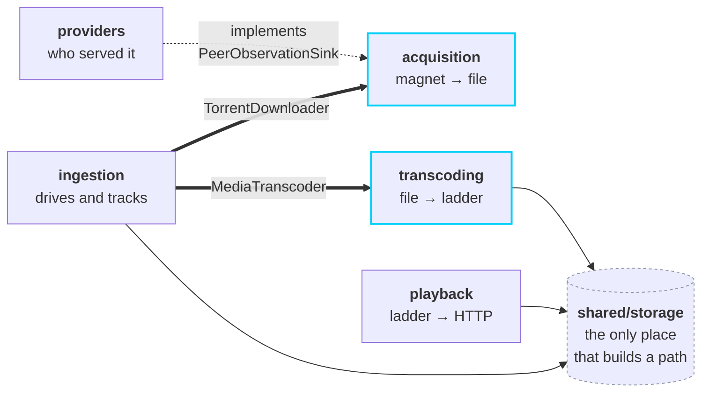
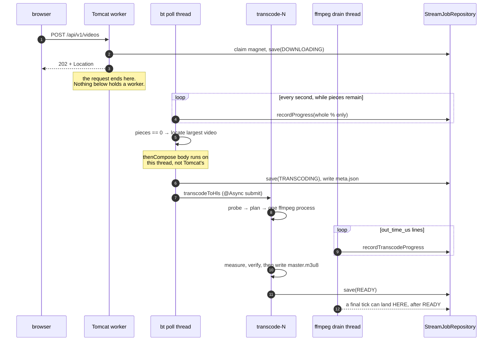
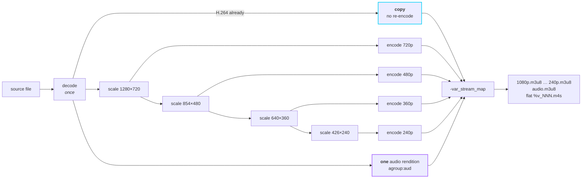
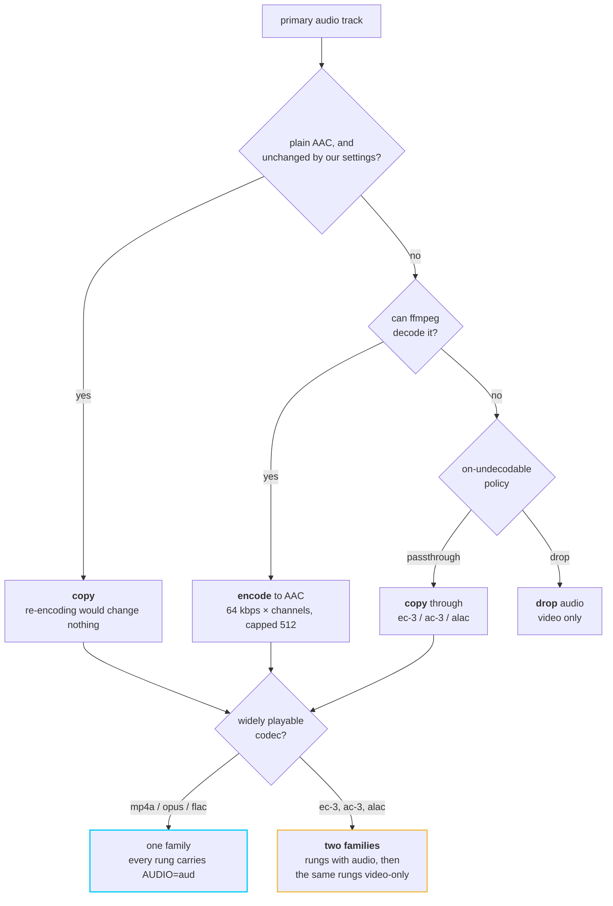
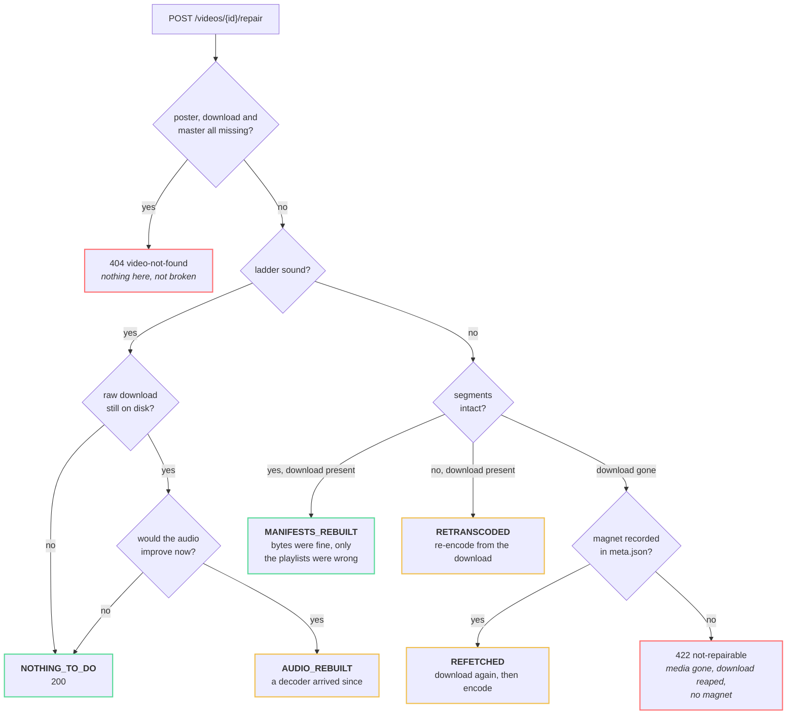
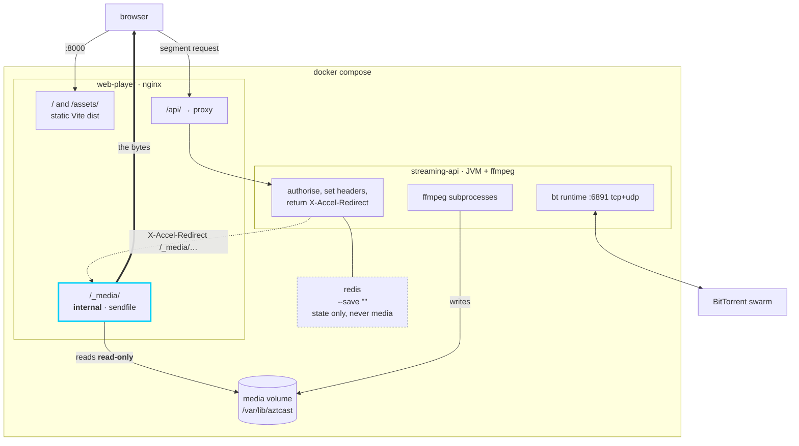

# Architecture

AZTCast turns a magnet link into an adaptive HLS stream. Three stages, in order,
and they are the top-level packages:

```
magnet URI ──▶ acquisition ──▶ transcoding ──▶ playback ──▶ browser
               (bt library)    (ffmpeg)        (HTTP)
                    │  └──────── ingestion ────────┘
                    │        (drives and tracks)
                    └──▶ providers  (records who served it)
```

`providers` hangs off acquisition rather than sitting in the line, because it is
observability: remove it and the pipeline still runs. It is off by default.

## Why package-by-feature

The domain *is* the pipeline, so the stages are the packages. Each has exactly
one reason to change: swap the torrent library, change the encoding ladder,
change how bytes are served.

The previous layout was package-by-layer (`controller/`, `service/`,
`service/impl/`, `model/`) and produced the failure that layering reliably
produces: `MagnetStreamingOrchestrator` imported `controller.request.MagnetUrl`,
so the service layer depended on the web layer. Layer packages offer nowhere to
put "the thing that coordinates a use case" and no boundary a compiler can see.

## Package map

```
com.azt.streaming
├── acquisition/          magnet URI -> a video file on disk
│   ├── domain/           TorrentDownloader (port), PeerObservation,
│   │                     PeerObservationSink (port out), SwarmSelfView
│   └── infrastructure/   BtTorrentDownloader, BtRuntimeConfiguration, EgressInterface,
│                         VideoFileLocator, LargestVideoFileSelector,
│                         MagnetTrackerInjector, PeerEventRecorder, PeerWireAgent
├── transcoding/          a media file -> an HLS ladder
│   ├── domain/           MediaTranscoder (port), MediaProbe (port), LadderPlanner,
│   │                     AudioPlanner, TranscodePlan, VariantPlaylist, LadderReport
│   └── infrastructure/   FfmpegMediaTranscoder, FfmpegCommandBuilder, TranscodePlanner,
│                         FfmpegCapabilities, ProcessRunner, FfmpegProgress,
│                         FfprobeMediaProbe, VariantWeigher, MasterPlaylistWriter,
│                         LadderIntegrity, SubtitlePublisher, FfmpegHealthIndicator
├── playback/             HLS assets -> HTTP
│   ├── web/              PlaybackController, HlsResponseFactory
│   ├── domain/           HlsAsset, HlsAssetLocator (port), HlsMediaTypes
│   └── infrastructure/   FileSystemHlsAssetLocator
├── ingestion/            drives the pipeline and records progress
│   ├── web/              IngestionController, LegacyVideoController, dto/
│   ├── domain/           StreamJob, StreamJobStatus, RepairAction, MagnetUri,
│   │                     StreamJobRepository (port), MagnetRegistry (port)
│   ├── application/      IngestionService, InterruptedJobReaper
│   └── infrastructure/   Redis / InMemory / Resilient StreamJobRepository,
│                         RedisMagnetRegistry
├── providers/            which peers served each video (opt-in)
│   ├── web/              ProviderPeerController, dto/
│   ├── domain/           ProviderPeer, ProviderSummary, PeerLocation, NetworkKind
│   ├── application/      ProviderPeerLog  (queue + one writer thread)
│   └── infrastructure/   SqliteProviderPeerRepository, ProviderSchema, GeoIpEnricher
└── shared/
    ├── config/           StreamingProperties, Async/Redis/RateLimit/Cors/Clock
    ├── storage/          MediaStorage (port), FileSystemMediaStorage, MediaReaper,
    │                     VideoCatalog, CatalogEntry, MediaDirectories
    ├── ratelimit/        RateLimiter (port), RedisTokenBucketRateLimiter, interceptor
    └── error/            GlobalExceptionHandler, ProblemTypes
```

## The slice graph

Every arrow is a compile-time dependency, and every one is held in place by a
rule in `ArchitectureTest`. The cyan boxes are the two ports; the cylinder is
the floor everything writes through.



**`providers → acquisition`, not the other way round.** Acquisition declares
`PeerObservationSink` and hands it plain types; providers implements it. So the
peer log can be switched off — the sink becomes `PeerObservationSink.NONE`, a
no-op — without acquisition knowing there was ever anything there.

Three things are missing from that figure, and each is missing on purpose,
because absence is what a dependency diagram is worst at showing:

- **No edge between `acquisition` and `transcoding`.** They never reference each
  other. Ingestion joins them, which is what lets either be tested without the
  other's process boundary.
- **`shared/config` sits under all of it** with no arrow drawn, because an arrow
  from every slice would say less than this sentence does.
- **`shared/error` points at every slice and nothing points back.** One
  `@RestControllerAdvice` has to name every slice's exceptions, so that package
  depends on all of them — safe only while the dependency stays one-way, which
  `ArchitectureTest.nothingDependsOnTheErrorBoundary` asserts. It is also why
  the package-cycle rule is scoped to the four pipeline slices rather than the
  whole tree.

## Where the ports are, and why only there

Interfaces exist at the two **process boundaries** — a BitTorrent swarm and the
ffmpeg binary — because that is where they pay for themselves. Neither can run
in a unit test, so `TorrentDownloader` and `MediaTranscoder` are what make
`IngestionService` testable in milliseconds.

Every other interface in the previous code existed for no reason and was
deleted. A one-implementation interface with no test double and no seam is a
liability, not abstraction.

## The catalogue reads the disk, not the job records

`VideoCatalog` answers "what can be watched" by listing HLS directories that have a
`master.m3u8` — the file transcoding writes last, so its presence is the readiness signal.

It deliberately does not consult `StreamJobRepository`. Job state is per-process when Redis is off
(the default) and expires under a TTL when it is on, while the media outlives both, so a catalogue
built on jobs goes empty after a restart with videos still sitting in the HLS root. That is not
hypothetical: it is the state a `docker compose` box lands in, because Redis runs with `--save ""`.

The one thing the disk cannot supply is a name, so ingestion writes `meta.json` beside the media
before the transcode starts. It lives inside the video's own directory so the reaper takes both at
once and they cannot drift apart. See
[ADR-0011](decisions/0011-the-library-replaces-manual-id-entry.md).

## `shared/storage` is the only place that builds a path

Both `transcoding` (writes) and `playback` (reads) go through `MediaStorage`.
Two places constructing filesystem paths from request data are two places that
can get containment wrong; there is one. It normalises and then proves the
result still sits under the media root, and it is where the directory creation
that used to silently fail now lives.

## `shared/error` is a sink, not shared infrastructure

One `@RestControllerAdvice` necessarily names every slice's exceptions, so
`shared.error` depends on all of them. That is safe only because nothing depends
on *it*, which `ArchitectureTest` asserts explicitly. The package cycle rule is
scoped to the four pipeline slices for the same reason.

## Fitness functions

`ArchitectureTest` holds thirteen ArchUnit rules. Each one encodes a defect this
codebase actually had, not a style preference — the layer inversion, the
`java.awt.Image` field on a headless server, the `System.out.println` calls, the
C#-style `I`-prefixed interfaces, the BitTorrent types that escaped
`acquisition`. They run in `mvn verify`, so CI fails on architectural erosion
rather than a reviewer having to notice it.

## Concurrency

`IngestionService` chains acquisition into transcoding with `thenCompose` and
records the outcome in `whenComplete`. Transcoding runs on a named executor
(`transcodingExecutor`) that `@Async` qualifies explicitly;
`AsyncTranscodingIntegrationTest` guards both the qualifier and `@EnableAsync`,
because losing either fails silently.

The pool's `max-size` is how many ffmpeg processes can run at once. ffmpeg's
memory is outside the JVM heap, so raise it and the container memory limit
together. `core-size` equals `max-size` on purpose: `ThreadPoolTaskExecutor`
only grows past core once the *queue* is full, so `core: 1` behind a 500-deep
queue would have produced a second thread on the 501st video and never before.

### What runs on which thread

One ingestion touches four different threads, and the handoffs are where the
defects were. `thenCompose` rather than `thenAccept`, because the earlier
version discarded the transcoder's future and every transcoding failure vanished
silently.



That last arrow is the reason `recordTranscodeProgress` filters on status. The
watcher runs on ffmpeg's output drain thread, which outlives the process by
however long the pipe takes to close — so a tick can arrive after the job is
already `READY`, and a writer that trusted its own ordering would walk a
finished job backwards. `recordProgress` has the same guard for the same reason.
See [ADR-0024](decisions/0024-transcode-progress-is-its-own-figure.md).

## The ladder is one ffmpeg process

The source is decoded once. Rungs are scaled in a **chain**, each from the one
above it, not fanned out from the original — measured at 21% less CPU across the
ladder, with the worst-case bottom rung at SSIM 0.998 against a direct
downscale. The top rung is not encoded at all when the source is already H.264
([ADR-0018](decisions/0018-the-top-rung-is-copied-not-encoded.md)), and one
audio rendition is shared by every rung
([ADR-0021](decisions/0021-one-audio-rendition-shared-by-every-rung.md)) rather
than encoded five times.



Four constraints on that command are not stylistic, and each cost something to
learn:

- **`-nostdin`.** Without it an ffmpeg that decides to ask "overwrite?" blocks
  on the parent's stdin until the thirty-minute deadline, with nothing in the
  log to say why.
- **Filenames stay flat.** `name:` in `-var_stream_map` makes `%v` expand to the
  rung name rather than an index. A `stream_0/playlist.m3u8` layout is
  *unreachable* through `/api/v1/stream/{videoId}/{file}`, whose single-segment
  `{file}` is a frozen contract.
- **No `-master_pl_name`.** ffmpeg writes its own master when the encode
  *starts*, which would fire the readiness sentinel minutes early.
- **`-force_key_frames`, not just `-g`.** It works in seconds, so it stays
  correct on a variable-frame-rate source. `-g`/`-keyint_min` are emitted only
  when a frame rate was actually reported.

Nothing is published until it is verified. `LadderIntegrity.verify` reads every
playlist back — segments named, present and non-zero, `EXT-X-ENDLIST` there,
`EXT-X-MAP` present exactly when the segments are fMP4 — and only then is
`master.m3u8` written. It is written **last**, and its existence is what makes
the video listable ([ADR-0026](decisions/0026-verified-before-it-is-published-repairable-after.md)).

## A ladder the browser accepts

The subtlest thing in the codebase. A variant's `CODECS` attribute describes the
whole combination, so an audio codec the browser cannot decode disqualifies the
**entire variant** — video included. Chrome answers `false` to
`isTypeSupported('video/mp4; codecs="avc1.640028,ec-3")`, and a master playlist
whose every rung says `ec-3` leaves it with nothing to play at all.

So when the audio had to be copied through in a format that is not widely
playable, every rung is advertised a second time with no `AUDIO=` group and a
video-only `CODECS`. Same media playlists, referenced a second way: not one
extra byte on disk.



Channels are kept as the source had them, and the bitrate follows from the count
rather than being fixed — 128 kbps at stereo, 384 at 5.1, which is what Apple's
authoring specification asks for
([ADR-0027](decisions/0027-audio-keeps-the-channels-the-source-had.md)). That is
also why a 5.1 AAC-LC source is a *copy* and not a pointless re-encode.
`hasWidelyPlayableVariant` is asserted against the **rendered bytes**, not the
plan, so a writer that quietly stopped emitting the second family would still
fail the check.

## Repair, and what it decides

`master.m3u8` used to be written whenever ffmpeg exited zero. Nothing had
checked that the segments the playlists name exist, nor that a browser could
assemble any of it — and once a library was published broken there was no way
back, because `startIngestion` always mints a fresh UUID and a viewer's link,
the library card and the keep marker are all the old one.

`POST /api/v1/videos/{id}/repair` fixes it **under the same id**, and does the
cheapest thing that will work:



`MANIFESTS_REBUILT` is the case worth having: the segments are bit-for-bit
correct and re-encoding would spend minutes producing identical bytes.
`AUDIO_REBUILT` is the case nothing else in the system would ever notice — the
ladder is complete, playable and listed either way, and the only thing that
changed is that a decoder got installed on the host since the ingestion.

## Deployment

nginx serves the player and reverse-proxies `/api` onto the same origin, so the
browser never makes a cross-origin request. That topology — not the CORS
configuration — is what allows the API to ship with an empty origin allowlist.



The thick edge is the point: the segment bytes never pass through the JVM.

Through the VPN overlay, `streaming-api` stops having a network of its own and
joins gluetun's namespace instead — so every packet it sends, DHT's UDP
included, leaves through the tunnel, and gluetun's firewall drops anything that
would not. A dropped tunnel therefore takes the API offline rather than falling
back to the open internet, which is the safe failure and the reason for doing it
this way ([ADR-0015](decisions/0015-ip-masking-belongs-to-the-network.md)).

### What Redis holds, and what it does not

State and coordination: job records, the magnet→videoId claim that makes
ingestion idempotent, and rate-limit buckets. **No media.** A value over roughly
a megabyte displaces thousands of useful keys and stalls Redis's single event
loop for every other client, and a segment is far larger than that.

The property that makes this safe to operate: **playback never touches Redis.**
Serving a segment is a path resolution and a `stat`. So a Redis outage means
"job status is unavailable", not "nobody can watch anything" — which is why the
fallbacks are simple rather than elaborate. Enabled only in the `docker` profile;
off by default.

### Who writes the segment bytes

nginx does, in the container topology. The API resolves the asset, checks
containment, sets `Content-Type` and `Cache-Control`, and returns **headers
only** with an `X-Accel-Redirect` into an `internal` location; nginx writes the
file with `sendfile`. A Tomcat thread is held for a path resolution and a
`stat`, not for the length of a transfer. See
[ADR-0007](decisions/0007-nginx-serves-the-bytes.md).

This is behind `aztcast.streaming.playback.offload-enabled`, **off by default**
and on in the `docker` profile, so a bare `mvn spring-boot:run` still serves
bytes itself. Both modes are covered by tests (`PlaybackControllerTest`,
`PlaybackOffloadTest`), because the risk here is a mode that only works in one
deployment.

Three couplings this introduces, none of them checkable at startup:

| API | nginx / compose |
| --- | --- |
| `playback.internal-prefix` | the `internal` `location` name |
| `storage.hls-dir` | that location's `alias` |
| — | the `media` volume must be mounted into the player container |

A mismatch in any of them is a silent 404 on every segment.
`scripts/smoke-test.sh` asserts all three against a running stack; run it with
`VIDEO_ID=<uuid>` to include the delivery checks.

## Known gaps

- **No authentication.** Anyone who can reach the API can make the server
  download arbitrary torrents.
- **Job state is in memory** when `aztcast.streaming.redis.enabled` is false
  (the default), and lost on restart. With Redis it survives — see
  [ADR-0009](decisions/0009-redis-for-state-not-for-media.md).
- Nothing resumes work across a restart. Interrupted jobs are failed at startup
  rather than left claiming progress, but the download does start over.
- **hls.js can stall on the demuxed audio group.** Recorded, with its evidence,
  in [docs/troubleshooting-hls.md](troubleshooting-hls.md) — the one item in
  that document still marked open.

### Corrected: HTTP Range support

This list used to claim there was none. That was wrong, and it is worth saying
why rather than quietly deleting the line.

Both playback mappings return `ResponseEntity<Resource>`. Spring's
`AbstractMessageConverterMethodProcessor` inspects the *runtime* body type, and
for a `Resource` it emits `Accept-Ranges: bytes`, converts a `Range` header into
a `206` via `HttpRange.toResourceRegions`, and answers `416` on an unsatisfiable
range — without any code here asking for it. `PlaybackControllerTest` now pins
this behaviour so it cannot be lost by accident.

The trap the old note would have led someone into: "properly streaming" a
segment with `StreamingResponseBody` or `InputStreamResource` **removes** range
support, because neither is a `Resource` body that the converter path
recognises. The gap was never missing functionality, only missing knowledge of
it.
